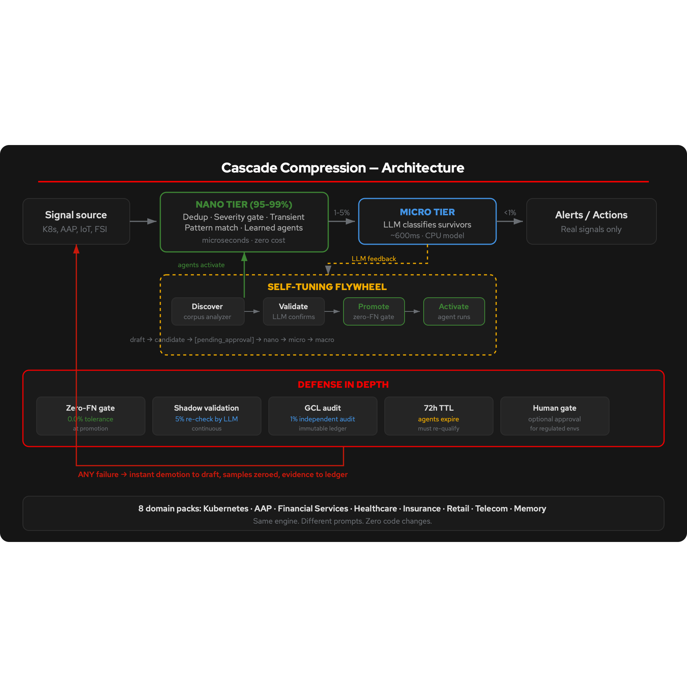

# Build governed memory for AI agents that never forgets

_Self-curating institutional memory for agentic systems, with zero tolerance for forgetting critical context._

## Table of Contents

- [Overview](#overview)
- [Who is this for](#who-is-this-for)
- [What can you point it at](#what-can-you-point-it-at)
- [Validated on production data](#validated-on-production-data)
- [Example: Watch memory form](#example-watch-memory-form)
- [Detailed description](#detailed-description)
  - [Architecture diagrams](#architecture-diagrams)
  - [How memory forms](#how-memory-forms)
  - [Defense in depth](#defense-in-depth)
- [See it in action](#see-it-in-action)
- [Requirements](#requirements)
  - [Minimum hardware requirements](#minimum-hardware-requirements)
  - [Minimum software requirements](#minimum-software-requirements)
  - [Required user permissions](#required-user-permissions)
- [Deploy](#deploy)
  - [Prerequisites](#prerequisites)
  - [Installation](#installation)
  - [Validating the deployment](#validating-the-deployment)
  - [Delete](#delete)
- [Repository structure](#repository-structure)
- [References](#references)
- [Tags](#tags)

## Overview

Your AI agent processes millions of signals a day. It classifies transactions, monitors infrastructure, triages alerts, screens content. Ask it tomorrow what it learned today and it has no answer. Its context window overflowed hours ago. The lessons it extracted are gone.

AI agents need institutional memory: a system that decides what matters, retains it, forgets what doesn't, and proves every decision to auditors. Not a data lake that remembers everything with no comprehension. A memory that curates itself.

The agentic memory cascade solves this. It ingests millions of signals per day, compresses 85-99% of noise deterministically, and retains only the survivors as institutional memory. Each memory is validated empirically (200+ samples, zero false negatives), decays naturally (72 hours), and is continuously re-verified by independent audit. The LLM only processes what the cascade cannot resolve -- typically 0.007% of signals.

## Who is this for

- **Platform engineers** building AI agents that must remember what happened across millions of daily events without calling an LLM for every signal
- **Compliance and risk teams** needing auditable proof of what an AI system learned, forgot, and why -- with an immutable ledger trail
- **SRE and AIOps teams** building observability agents that learn from incidents and carry that knowledge forward, not just the most recent alert
- **Anyone drowning in signal noise** -- if your agents process more data than fits in a context window, the cascade gives them bounded, relevant, governed memory

## What can you point it at

Anything that produces a stream of signals. The cascade doesn't care what the signals are. It learns what matters and what doesn't.

| Signal source | What the cascade learns | What memory looks like |
|---|---|---|
| **Factory floor sensors** | Which temperature, vibration, and pressure readings are normal operating range | "Vibration on Line 3 between 2.1-2.8mm/s is always normal" -- agent filters 94% of readings |
| **Robotic arm telemetry** | Which motion patterns indicate routine operation vs calibration drift | "Joint 4 torque variance under 0.3Nm during pick-place is normal" -- surfaces only anomalies |
| **Agent output / decision logs** | Which decisions the agent makes repeatedly vs which are novel | "Routing to tier-1 support for password resets is always the right call" -- auto-routes 80% |
| **Financial transactions** | Which transaction patterns are routine vs suspicious | "Domestic transfers under $500 with established history are always routine" -- flags only anomalies |
| **Kubernetes events** | Which pod restarts, OOM kills, and scaling events are normal churn | "CrashLoopBackOff on init containers in ci-runners namespace is always transient" -- 99.1% compressed |
| **Healthcare alerts** | Which clinical signals are routine vs require attention | "Heart rate 60-100 bpm with stable trend is normal" -- surfaces only deviations |
| **IoT / edge devices** | Which readings are within operating parameters vs indicate failure | "Humidity sensor reads between 40-60% RH during business hours" -- alerts only on drift |

The domain pack is three files: a collector (how to read the signals), a one-paragraph prompt (what "matters" means in this domain), and seed data. The cascade framework stays untouched.

## Validated on production data

This isn't theoretical. The cascade has been validated on real production signal streams in a multi-day soak across 10 OpenShift clusters and 3 organizational knowledge sources:

| Metric | Value |
|---|---|
| **Live signals processed** | **5.5M+** operational + **34K+** organizational knowledge |
| **Replay signals processed** | **142.4 million** (Kubernetes production replay) |
| **Aggregated memories** | **20,900+** across 3 federated cascades (K8s + AAP + Knowledge) |
| **GPU deep analyses** | **19,000+** (found real issues: ACM channels missing, MetalLB misconfiguration, OCS version conflicts) |
| **Contextual suppressors discovered** | **101** (learned organically, not hand-written) |
| **Memory evictions** | **700K+** (consolidation aggressively separating signal from noise) |
| **Edge scenarios tested** | **61** adversarial scenarios across 3 industry verticals, all passing |
| **False negatives** | **0** |

| Domain | Source | Compression | What it surfaced |
|---|---|---|---|
| **Kubernetes** | 10 live clusters + 142.4M replay | **99.1%** | 3 self-discovered agents. LLM saw 0.007% of signals. |
| **Ansible (AAP)** | Live platform | **98.1%** | 63 shadow demotions (self-corrected mistakes). |
| **Org Knowledge** | Jira, GitHub (819 repos), Confluence | **83%** | Runbook decay, decision churn, hotfix/revert patterns, expertise concentration. |

All five safety layers active throughout: zero-FN gate, 5% shadow validation, GCL audit loop, 72h TTL, and human gate. The cascade discovered 101 contextual suppressors on its own -- no human wrote a single rule.

## Example: Watch memory form

Run the demo and watch the dashboard. Here's what happens:

**Minute 0-1: Cold start.** The cascade has no learned memory. Every signal goes to the LLM for classification. Compression is 0%. Everything is new.

**Minute 1-2: First pattern emerges.** The corpus analyzer notices a recurring signal type that the LLM always classifies as noise. It proposes a draft agent -- a deterministic rule to handle this pattern. The agent appears on the Memory Map tab.

**Minute 2-3: Memory forms.** The draft agent hits 200 samples with zero false negatives. It's promoted to active. Compression jumps. On the dashboard, the compression gauge climbs and the agent card shows "nano" tier.

**Minute 3-4: More agents activate.** The cascade discovers more patterns. Each agent handles one type of noise. Compression climbs to 60-85%. The LLM is only processing what the cascade genuinely can't resolve.

**Minute 4-5: Self-correction.** Shadow validation catches an agent that started missing a new pattern. The agent is instantly deactivated -- you see it strikethrough on the Memory Map with the reason. The cascade learns from the correction and tightens its rules.

**Minute 5+: Institutional knowledge.** The survivor archive now contains a curated record of everything that mattered. Query it: "What has the system learned?" The answer is a compressed narrative of significant events, not a log search.

```bash
./demo.sh              # See it live — no LLM needed, runs on a laptop
```

## Detailed description

The cascade maps directly to how memory works. Raw signals arrive as sensory input. The nano tier (working memory) filters and pattern-matches, discarding most input at sub-millisecond latency. The micro tier (episodic memory) classifies notable events using a small CPU model. Macro survivors become semantic memory: a compressed, curated record of things that actually mattered.

The critical difference from a data lake: a data lake remembers everything with no comprehension. It cannot tell you what mattered. The cascade can, because it learned what the LLM considers noise and encoded that knowledge as executable deterministic rules. The LLM only processes what the cascade cannot resolve (typically 0.007% of signals).

Each vertical is a "domain pack" -- a collector, a one-paragraph prompt, and historical data. The memory framework stays untouched. You choose your domain at deploy time, or write your own in three files.

### Architecture diagrams



```
Any signal -> [Encoding]  -> [Working Memory] -> [Episodic Memory] -> [Semantic Memory]
              Nano tier      Pattern match       CPU model classify    Survivor archive
              (85-99%)       (sub-ms)            (~800ms)             (query anytime)
                   ^                                    |
                   +---- Shadow validation (5%) --------+
                   ^                                    |
                   +---- GCL audit (1%) ---------------+
                   ^                                    |
                   +---- 72h decay + re-qualify -------+
```

### How memory forms

| Memory stage | Cascade mechanism | Example |
|---|---|---|
| **Encoding** | Corpus analyzer proposes a draft agent | "CrashLoopBackOff on init containers in ci-runners is always transient" |
| **Consolidation** | 5-tier promotion (draft -> candidate -> nano) | Agent tested against 200+ real signals with 0% false negatives |
| **Recall** | Nano agent fires on matching signal | New CrashLoopBackOff in ci-runners instantly suppressed, no LLM call |
| **Forgetting** | 72h TTL + shadow demotion | Infrastructure patterns shift -- yesterday's rule may not hold |
| **Priming** | Threshold modulation after significant event | After a real outage, related signal types get lower suppression thresholds |

### Defense in depth

Five layers, none trusting each other:

| Layer | What it does |
|---|---|
| **Zero-FN gate** | 200+ samples with 0% false negatives before a memory forms |
| **Shadow validation** | 5% of suppressed signals re-checked by LLM -- catches drift |
| **GCL audit loop** | Independent system samples 1%, writes verdicts to immutable ledger |
| **72h TTL** | Memories expire and must re-qualify against current data |
| **Human gate** | Optional approval before memories form (for regulated environments) |

One false negative from any source and the memory is instantly deactivated, samples zeroed, evidence chain written to the immutable ledger.

> **Note:** The GCL (Governed Cognitive Loop) audit layer is a separate application, not included in this quickstart. It provides independent verification of cascade decisions via an immutable ledger. The cascade runs without it -- the GCL adds an additional layer of governance for production deployments. See [governed-cognitive-loop](https://github.com/jkershawrh/governed-cognitive-loop) for more.

## See it in action

The demo uses [Ollama](https://ollama.com) to run IBM Granite 3.2 8B Instruct locally on CPU. This is the same model validated in production (14/20 classification score, zero dangerous misses).

```bash
# Install Ollama first: https://ollama.com
./demo.sh              # Pulls the model, starts the service, opens the dashboard
./demo.sh finance fast  # Financial services domain, fast replay
./demo.sh telecom slow  # Telecom domain, slow for presentations
```

The Gradio dashboard at `http://localhost:7860` shows:
- **Signal Stream** -- live feed of signals being compressed or surviving, with severity and agent
- **Memory Map** -- agents appearing, progressing through promotion tiers, activating
- **Compression** -- real-time gauge climbing as agents learn what is noise
- **Audit Trail** -- every memory decision with provenance chain

**Requirements:** [Ollama](https://ollama.com) installed, ~5 GB disk for the model, 16 GB RAM recommended.

> **How the demo works:** The demo starts with a pre-learned seed state — 3 agents that the cascade discovered during a prior training run on financial services signals. These agents already compress routine dispute classifications, compliance screenings, and document extractions. When you run the demo, new signals hit the cascade and you see these agents working immediately: compression starts at ~60% and climbs as the LLM classifies more signals and the cascade discovers additional patterns. On production hardware (Intel Xeon 6), the cascade learns these agents from scratch in minutes. The seed state lets you see the result on any hardware without waiting for the full learning cycle.

## Industry domain packs

Choose your industry at deploy time. Each domain is a collector, a one-paragraph prompt, and historical data.

| Domain | Scenario | Compression | Safety guarantee |
|---|---|---|---|
| **Retail** | Campaign signals, ad performance, audience behavior | 88.3% | 100% shrinkage recall, 100% compliance |
| **Financial services** | Transaction monitoring, fraud, compliance | 61.1% | 92.7% fraud recall, 100% compliance |
| **Healthcare** | Clinical signals, patient safety, diagnostic alerts | 91.0% | 96.6% critical recall, 99.0% compliance |
| **Insurance** | Claims monitoring, fraud patterns, risk signals | 81.2% | 100% fraud recall, 99.8% compliance |
| **Telecom** | Network events, incident detection, capacity signals | 94.3% | 92.1% incident recall |
| **Kubernetes** | Production operations (validated on 142.4M signals) | 99.1% | 0 false negatives |
| **Org Knowledge** | Jira/Git/Confluence -- runbook decay, decision churn | 83% | Knowledge gap detection |

> **Building a custom domain pack?** See the [Domain Pack Guide](docs/domain-pack-guide.md). A domain pack is three files: a collector, a one-paragraph prompt, and seed data. The cascade framework stays untouched.

## Intel inference architecture

The cascade is designed around the economics of CPU vs GPU inference. The insight: 85-99% of signals are noise that a deterministic rule can handle in microseconds. Only the survivors need an LLM. This changes the hardware equation.

| Tier | What runs | Hardware | Latency | Cost per signal |
|---|---|---|---|---|
| **Nano** (85-99% of signals) | Deterministic agents — pattern matching, dedup, severity gates | Intel Xeon CPU | **< 1ms** | Near zero |
| **Micro** (1-15% of signals) | Small LLM classification — Granite 8B, Phi-4 Mini | Intel Xeon CPU | **~800ms** | Low (CPU inference) |
| **Macro** (< 0.1% of signals) | Deep analysis — root cause, evidence bundles | GPU or large CPU model | **seconds** | Higher, but rare |

The nano tier runs on pure CPU at sub-millisecond latency. No GPU, no inference server, no model loading. It's deterministic code executing on Intel Xeon cores. This handles the vast majority of your signal volume.

The micro tier runs a small model on CPU. Benchmarked on Intel Xeon 6 (128 cores):

| Model | Score | Latency | Dangerous misses |
|---|---|---|---|
| IBM Granite 3.2 8B Instruct | 14/20 | 860ms | **0** |
| Microsoft Phi-4 Mini | 14/20 | 734ms | **0** |

Both models: every error is over-escalation (safe failure), never dismissal. No GPU required. Intel AMX acceleration on Xeon 4th Gen+ further reduces micro-tier latency.

The macro tier handles the rarest, most complex signals — deep root cause analysis, evidence bundle construction, cross-domain correlation. This is where GPU acceleration (Intel or otherwise) adds value, but it processes < 0.1% of signals. In the production soak, the macro tier produced 19,000+ deep analyses that found real infrastructure issues no single alert would surface.

**The result:** You don't need GPU infrastructure for 99%+ of your signal processing. The cascade runs the volume on Intel Xeon CPU and escalates to GPU only for the signals that genuinely need deep reasoning.

**Tested on Intel hardware end-to-end.** All production benchmarks (5.5M+ live signals, 142.4M replay, 19,000+ GPU analyses) ran on Intel Xeon 6 (128-core Xeon 6767P) for CPU inference and Intel accelerators for the GPU macro tier. The numbers in this README come from Intel silicon, not theoretical projections.

> **Powered by Intel** -- Validated on Intel Xeon 6 and Intel accelerators. CPU handles the volume. GPU handles the depth.

## Requirements

### Minimum hardware requirements

| Component | Minimum | Recommended |
|---|---|---|
| CPU cores | 4 | 8+ (Intel Xeon recommended) |
| Memory | 16 GiB (for Granite 8B model) | 32 GiB |
| Storage | 10 GiB (+ ~5 GiB for model weights) | 20 GiB |

### Minimum software requirements

| Requirement | Version | Purpose |
|---|---|---|
| Python | 3.9+ | Cascade engine |
| [Ollama](https://ollama.com) | Any | Local LLM inference (pulls Granite 3.2 8B) |
| Red Hat OpenShift | 4.14 or later | For cluster deployment (not required for local demo) |

### Required user permissions

This quickstart can be deployed by a regular user with namespace-level permissions.

## Deploy

### Prerequisites

- An OpenAI-compatible LLM endpoint (vLLM, Ollama, or cloud API)
- An API key for the LLM endpoint

### Installation

**Option A: Deploy on Red Hat OpenShift**

```bash
oc new-app https://github.com/jkershawrh/agentic-memory-cascade \
  -e CASCADE_DOMAIN=retail \
  -e CASCADE_LLM_URL=https://your-llm/v1 \
  -e CASCADE_LLM_KEY=sk-...
```

**Option B: Deploy with a different domain**

```bash
# Financial services
oc new-app https://github.com/jkershawrh/agentic-memory-cascade \
  -e CASCADE_DOMAIN=finance \
  -e CASCADE_LLM_URL=https://your-llm/v1 \
  -e CASCADE_LLM_KEY=sk-...

# Healthcare
oc new-app https://github.com/jkershawrh/agentic-memory-cascade \
  -e CASCADE_DOMAIN=healthcare \
  -e CASCADE_LLM_URL=https://your-llm/v1 \
  -e CASCADE_LLM_KEY=sk-...
```

**Option C: Run locally with historical data**

```bash
git clone https://github.com/jkershawrh/agentic-memory-cascade.git
cd agentic-memory-cascade
pip install -e ".[dev]"

# Replay ad campaign data
cascade-replay --domain retail --data campaign_events.csv --llm-url https://your-llm/v1

# Or run live with Kubernetes signals
cascade-run --domain kubernetes --llm-url https://your-llm/v1 --llm-key sk-...
```

**Start the real-time dashboard:**

```bash
python3 -m uvicorn cascade_compression.service:app --port 8090
# Open http://localhost:8090
```

### Validating the deployment

```bash
# Run the full test suite (776 tests)
make test-all

# Check cascade status
curl -s http://localhost:8090/stats | python3 -m json.tool
```

### Delete

```bash
oc delete all -l app=agentic-memory-cascade
```

## Repository structure

```
.
├── cascade_compression/          # Core engine
│   ├── cascade/                  # Pipeline, agents, promotion, memory, recall
│   ├── collectors/               # 20 collectors (k8s, aap, jira, git, confluence, ...)
│   ├── domains/                  # 10 domain packs (choose at deploy time)
│   ├── routing/                  # Benchmark-graded model selection
│   ├── tco/                      # TCO calculator
│   ├── infra/                    # Pressure-aware scaler, fleet manager
│   ├── integrations/             # Immutable ledger client
│   ├── service.py                # FastAPI service with dashboard
│   └── cli.py                    # cascade-run, cascade-replay entrypoints
├── benchmarks/                   # Harness, configs, corpora, results
├── contracts/                    # OpenAPI specs + JSON schemas (memory-event, memory-record)
├── docs/                         # Architecture, whitepaper, memory formation model
├── tests/                        # 776 tests
├── Containerfile                 # UBI9 Python 3.11
├── Makefile
├── LICENSE
└── README.md
```

## References

- [Cascade as Memory](docs/cascade-as-memory.md) -- how the cascade forms institutional knowledge
- [Memory Whitepaper](docs/cascade-as-memory-whitepaper.md) -- full thesis with biological analogs
- [Architecture](docs/architecture.md) -- technical deep-dive
- [Model Benchmarks](docs/model-benchmarks.md) -- 6-model comparison on Xeon 6
- [Domain Pack Guide](docs/domain-pack-guide.md) -- add a new domain in three files
- [Promotion Guidelines](docs/promotion-guidelines.md) -- how memories form and decay

## Tags

- **Title:** Build governed memory for AI agents that never forgets
- **Description:** Self-curating institutional memory for agentic systems, with zero tolerance for forgetting critical context
- **Industry:** Media and IT services
- **Product:** Red Hat OpenShift AI
- **Use case:** AI inference
- **Partner:** Intel
- **Contributor org:** Red Hat
